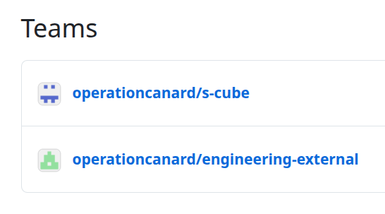
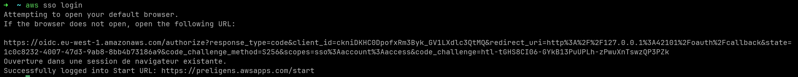
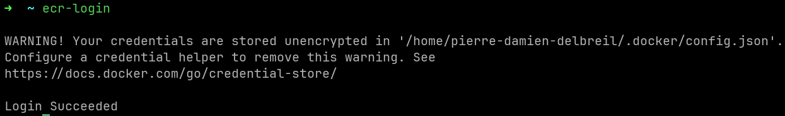
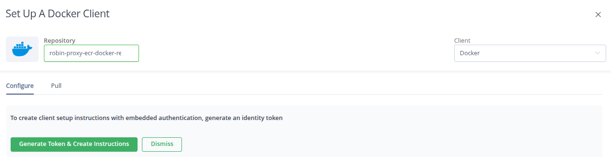

# scube_first_install_ubuntu

## 1 : Install Dependencies Ubuntu 

**from: https://docs.docker.com/engine/security/rootless/**

```sh

curl -fsSL https://get.docker.com | sudo bash

echo 'setup docker to be rootless'

sudo groupadd docker
sudo usermod -aG docker $USER
newgrp docker
sudo systemctl disable --now docker.service docker.socket
sudo rm /var/run/docker.sock
sudo apt-get install -y uidmap
dockerd-rootless-setuptool.sh install


echo "path+=('/usr/bin')" > ~/.zshrc 
echo 'export DOCKER_HOST=unix:///run/user/1000/docker.sock' > ~/.zshrc

echo 'install build stuff like make'
sudo apt-get install build-essential

echo 'install scube mise en place'
curl https://mise.run | sh

```

### Docker rootless

```sh
export DOCKER_HOST=unix:///run/user/1000/docker.sock # from echo $DOCKER_HOST
export BUILDX_BAKE_ENTITLEMENTS_FS=0
```

## 2 : GitHub 

#### be sure to be part of teams



#### Token 
##### Duplicates for mise run to be able to download without being rate limited
export GITHUB_TOKEN=<JS_CROSSTEAM_GITHUB_TOKEN> # Duplicated for having

#### Verify Access to custom packages with 
`curl https://npm.pkg.github.com/download/@operationcanard/utils/3.1.2/6438e47253140b935b5654b981111ead1b1199e3 -H "Authorization: Bearer <JS_CROSSTEAM_GITHUB_TOKEN>"`

## 3 : Clone scube and builds and run

```
git clone git@github.com:operationcanard/scube.git
cd scube
bake
```

## 4 : AWS CLI

```sh
➜  ~ cat .aws/config
[profile Engineer-Robin]
sso_session = Engineer-Robin
sso_account_id = 026153949073
sso_role_name = Engineer@robin-dev
region = eu-west-1
output = json

[profile Tooling]
sso_session = Engineer-Robin
sso_account_id = 576707956959
sso_role_name = Audit@tooling-dev
region = eu-west-1
output = json

[sso-session Engineer-Robin]
sso_start_url = https://preligens.awsapps.com/start
sso_region = eu-west-1
sso_registration_scopes = sso:account:access

[default]
region = eu-west-1
```

### add into your .zshrc 
```sh
export AWS_PROFILE=Engineer-Robin

alias ecr-login='aws ecr get-login-password --region eu-west-1 | docker login --username AWS --password-stdin 576707956959.dkr.ecr.eu-west-1.amazonaws.com'
```

### 1 try to login with

`aws sso login`



### 2 log into ecr

`ecr-login`




## 5 : Artifactory



Gived me access to all ecr repo no granularity but only efficiency

## 6 : Build & Run

### Light (FULLSTACK to work on frontend)
```
docker buildx bake dev
docker buildx bake robin-airflow-db
docker compose -f docker-compose-scube.yml up --build traefik airflow-postgres airflow-webserver airflow-scheduler airflow-triggerer pgweb scube-api minio appli-front
```